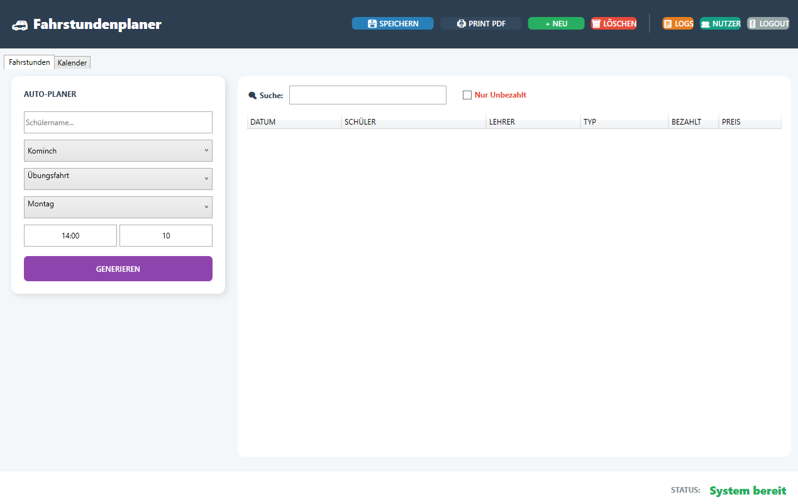
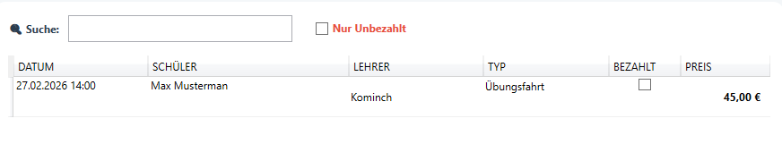

# Fahrschule-Fahrstundenplaner

Dieses Projekt implementiert ein Fahrschulsystem zur Planung und Verwaltung von Fahrstunden.
Es enthält eine vollständige SQL-Datenbankstruktur, ein C#-Konsolenprototyp, ER-Diagramme
und dokumentierte Berichte über den Einsatz von KI-Tools.

## Hauptfunktionen
- Verwaltung von Schülern und Instruktoren  
- Planung, Buchung und Statusverwaltung von Lektionen  
- Dateibasierte Datenspeicherung im Konsolenprototyp  
- Dokumentation, SQL-Skripte und ER-Diagramme  

## Autor
**Anastasia Kominch**

Alle Projektanforderungen wurden erfolgreich umgesetzt.

Close all requirements. Closes #2, #3, #4, #5, #6

# Fahrstundenplaner

## Beschreibung
Der Fahrstundenplaner ist eine Desktop-Anwendung (WPF), die speziell für Fahrlehrer und Fahrschüler entwickelt wurde. Das Programm ermöglicht es, Fahrstunden effizient zu verwalten, Termine zu suchen und den Zahlungsstatus von Schülern im Blick zu behalten.

## Nutzung des Programms
Das Programm ist intuitiv gestaltet:
1. **Übersicht:** Nach dem Start sehen Sie eine Tabelle mit allen geplanten Fahrstunden.
2. **Suche:** Geben Sie im Suchfeld einen Schülernamen ein, um die Liste sofort zu filtern.
3. **Filter:** Nutzen Sie die Checkbox "Nur Unbezahlt", um ausstehende Zahlungen schnell zu identifizieren.

*Abbildung 1: Die Hauptansicht der Anwendung.*

*Abbildung 2: Demonstration der Such- und Filterfunktion.*

## Screencast
Eine vollständige Demonstration der Anwendung finden Sie im folgenden Video:
[Video ansehen: Nutzung des Fahrstundenplaners](Dokumentation/demo_video.mp4)

